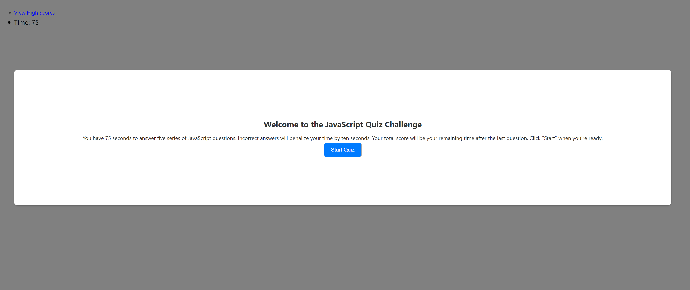

# Quiz-Code

## Description

This project is a web-based quiz application designed to test users to challenge their knowledge of the language model. It features a user-friendly interface and a timer-based scoring system. Questions are presented one at a time, and each incorrect answer results in a time penalty.

## Installation
N/A

## Usage 

You can access the website here: https://rodrigo0599.netlify.app/

Start the Quiz: Click on the 'Start Quiz' button.

Answer Questions: Select your answer from the multiple-choice options for each question.

View Score: After completing the quiz or when the timer runs out, your score will be displayed.

Save Score: Enter your initials to save the score.

View High Scores: Access the high scores from the main menu.

## License 
MIT License 
